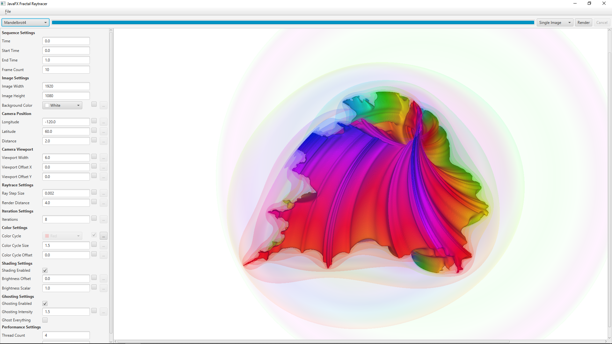

# JavaFX Fractal Raytracer

A simple raytracing program which renders still images and animations of 3D fractals and other shapes.

## Installation

Download the executable JAR file from [here](https://github.com/justinyaodu/javafx-fractal-raytracer/raw/master/jar/javafx-fractal-raytracer.jar). This program (unsurprisingly) requires Java installed to run.

To start the program, open the downloaded JAR file in Java, or execute `java -jar javafx-fractal-raytracer.jar` from the command line.

## Screenshots and Animations

 

 

_Generated with [apngasm](https://github.com/apngasm/apngasm) and [ffmpeg](https://www.ffmpeg.org/). 1080p videos available for download [here](media/mp4/)._

## Features

### Implemented

* Multithreading support
* Keyframe-based animation system
* A variety of fractals and other interesting shapes to explore
* Lots of configurable parameters
* Shading and ghosting effects

### Todo

* Animated help graphics
* Help and about
* Code documentation
* More fun shapes!

### Out of Scope (for this project)

* GPU acceleration
* Direct export of animated image or video files ([apngasm](https://github.com/apngasm/apngasm) and [ffmpeg](https://www.ffmpeg.org/) can help with this)

## License

This software is licensed under the [MIT License](LICENSE).

## Meta

The author wanted to play with some three-dimensional analogues of the famous [Mandelbrot set](https://en.wikipedia.org/wiki/Mandelbrot_set), so he wrote a raytracer to render it. Then he thought it needed to be prettier, so he implemented color and shading... but it was still difficult to visualize three-dimensionally, so he added animation support too. He thought it would be nice to share this creation with others, so the user interface was tidied up and improved. And it seems the internet is a good place to share software, so here it is. Enjoy!

Please remember that this software was written for fun in two weeks by an amateur programmer. There is certainly potential for further performance optimizations, code restructuring, bug fixing, etc. so feel free to make suggestions!
